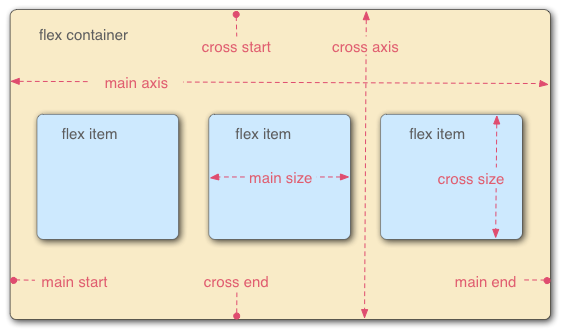
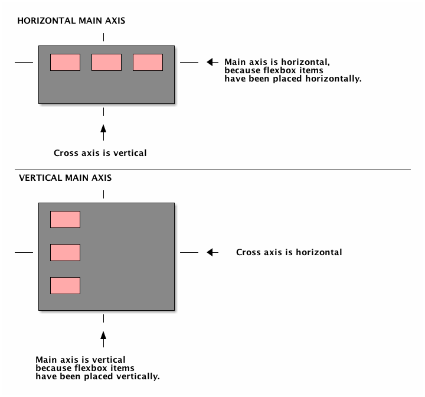

[UP](./index.md)

# Collective Alignment
Sometimes the flex items within a flex container do not fill all the space in the container.  
It is common to want to tell CSS how to align and space out the flex items a certain way. 

The direction the flex items are arranged is called the **main axis**.  
- for a row, this is a horizontal line that cuts through each item.  
- for a column, this is a vertical line through the items.

## justify-content
There are several options for **how to space the flex items along the line that is the main axis**.

- **center**, which aligns all the flex items to the center inside the flex container
- **flex-start**: aligns items to the start of the flex container. For a row, this pushes the items to the left of the container. For a column, this pushes the items to the top of the container.
- **flex-end**: aligns items to the end of the flex container. For a row, this pushes the items to the right of the container. For a column, this pushes the items to the bottom of the container.
- **space-between**: aligns items to the center of the main axis, with extra space placed between the items. The first and last items are pushed to the very edge of the flex container. For example, in a row the first item is against the left side of the container, the last item is against the right side of the container, then the other items between them are spaced evenly.
- **space-around**: similar to space-between but the first and last items are not locked to the edges of the container, the space is distributed around all the items

## align-items
Recall that the `justify-content` property aligned flex items along the main axis. 
- For rows, the main axis is a horizontal line
- for columns it is a vertical line.  

Flex containers also have a **cross axis which is the opposite of the main axis**. 
- For rows, **the cross axis is vertical** 
- For columns, **the cross axis is horizontal**

CSS offers the `align-items` property to align flex items along the cross axis. 
- for a row, it tells CSS how to push the items in the entire row up or down within the container
- for a column, how to push all the items left or right within the container.  

There are several options for **how to space the flex items along the line that is the cross axis**.
- **center**: align items to the center. For rows, this vertically aligns items (equal space above and below the items). For columns, this horizontally aligns them (equal space to the left and right of the items)
- **flex-start**: aligns items to the start of the flex container. For rows, this aligns items to the top of the container. For columns, this aligns items to the left of the container.
- **flex-end**: aligns items to the end of the flex container. For rows, this aligns items to the bottom of the container. For columns, this aligns items to the right of the container.
- **stretch**: stretch the items to fill the flex container. For example, rows items are stretched to fill the flex container top-to-bottom.
- **baseline**: align items to their baselines. Baseline is a text concept, think of it as the line that the letters sit on.