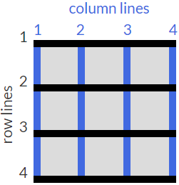

[UP](./index.md)

# Area Templates

## grid-template-areas
You can group cells of your grid together into an area and give the area a custom name. Do this by using grid-template-areas on the container like this:

	.container {
		...
		grid-template-areas:
			"header header header"
			"advert content content"
			"footer footer footer";
		...
	}

The code above:
- merges the top three cells together into an area named header
- merges the bottom three cells into a footer area
- makes two areas in the middle row; advert and content.

- every word in the code represents a cell
- every pair of quotation marks represent a row.

Also: In addition to custom labels, you can use a period (.) to designate an empty cell in the grid.

## grid-area

### with grid-template-areas
After creating an areas template for your grid container you can place an item in your custom area by referencing the name you gave it. 

To do this, you use the grid-area property on an item like this:

	.item1 { grid-area: header; }

This lets the grid know that you want the item1 class to go in the area named header. In this case, the item will use the entire top row because that whole row is named as the header area.

### without grid-template-areas
If your grid doesn't have an areas template to reference, you can create an area on the fly for an item to be placed like this:

	item1 { grid-area: 1/1/3/4; }

This is using the line numbers:

The numbers in the example above represent these values:

- horizontal line to start at
- vertical line to start at
- horizontal line to end at
- vertical line to end at

So the item in the example will consume:
- the rows between lines 1 and 3
- the columns between lines 1 and 4.

  

  
1

