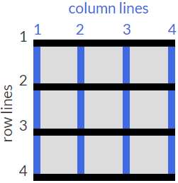

[UP](./index.md)

# Grid Item Manipulation
- **grid-column** property -control the amount of columns an item will consume
- **grid-row** property -control the amount of rows an item will consume

	.item4{
		background:LightPink;
		grid-row: 2/4; /* starts at vertical line 1 ends at vertical line 4 */
	}
	.item5 {
		background: PaleGreen;
		grid-column: 2/4; /* starts at horizontal line 1 ends at horizontal line 4 */
	}

  

  
1

  
2

  
3

  
4

  
5

