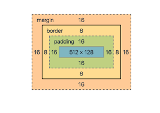

[UP](../index.md)

# Cascade Style Sheets

## Basics

### Using CSS
Three ways to use CSS:
- **inline style attribute** `style="color:blue;"`
- **style tags** ``
- **external style sheet** `<link rel="stylesheet" href="./styles.css">`  

### Comments
Comments: `/* COMMENT HERE */`

### Syntax
CSS has two building blocks: a **property** and a **value**
- Declaration	`prop:val`
- Declaration Block	`{prop:val}`
- CSS Rule	`selector {prop:val}`

### Selector

#### Basic

##### Type

	p {color:red}

##### Class

	.done {color:red}

##### Id

	#warn {color:red}

##### Universal

	* {color:red}

#### Advanced
- [attribute](./attr.md)
- [pseudo-classes](./ps-class.md)
- [pseudo-elements](./ps-ele.md)
- [combinators](./comb.md)

### [Inheritance](./inheritance.md)
### [Units](./units.md)

### Box Model

- [box-sizing property](./box-size.md)

## @rules
an At-rule is a CSS statement that instructs CSS how to behave  

Not Nested:
- @charset	`@charset "utf-8";` must be placed at the top of, and can only appear in an external style sheet
- @import	`@import url;` or `@import url list-of-media-queries;`. Will only load the resource if the media queries are supported

Nested:
- [@media](./media-queries.md)
- [@font-face](./fonts.md#font-face)
- [@keyframes](./animate/keyframes.md)

## Visuals
- [Colors](./colors/index.md)
- [Typography](./fonts.md)
- [background property (linear-gradient,repeating-linear-gradient, url)](./backgrounds.md)
- [box-shadow property](./shadows.md)

## Layout
- [Positioning](./positioning.md)
- [transform propery (scale, translate, skewX, skewY)](./transformations.md)

Responsive Web Design:
- [Device Sizes](./devicesizes.md)
- [Responsive Images](./res-imgs.md)
- [Responsive Typography](./res-type.md)
- [Flex Box](./flex/index.md)
- [Grid](./grid/index.md)

## Graphics
- [CSS Graphics](./graphics.md)
- [Animations](./animate/index.md)

## Variables
- [CSS Variables](./variables.md)

## 3rd Party Libraries
- [Bootstrap](./bs/index.md)