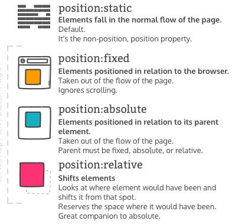
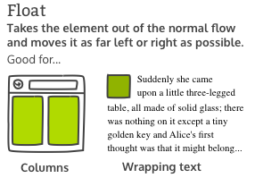

[UP](./index.md)

# Positioning
CSS treats each HTML element as its own box, which is usually referred to as the CSS Box Model. 
- **Block-level items** automatically start on a new line (think headings, paragraphs, and divs)
-  **inline items** sit within surrounding content (like images or spans).  

The default layout of elements in this way is called the normal flow of a document, but CSS offers the position property to override it.

## Position Property
  

### offsets
The CSS offsets are
- top
- bottom
- left
- right  

They tell the browser **how far to offset an item relative to where it would sit in the normal flow of the document**.  

You're offsetting an element away from a given spot, which **moves the element away from the referenced side (effectively, the opposite direction)**.  

i.e using the top offset actually moves the element down

### Relative Positioning
Allows you to specify **how CSS should move it relative to its current position in the normal flow of the page**.  

It pairs with the CSS offset properties. These say how many pixels, percentages, or ems to move the item away from where it is normally positioned.  

The following example moves the paragraph 10 pixels away from the bottom:

	p {
	  position: relative;
	  bottom: 10px;
	}

Changing an element's position to relative **does not remove it from the normal flow** - **other elements around it still behave as if that item were in its default position**.

### Absolute Positioning
**Locks the element in place relative to its parent container**.  

Unlike the relative position, this **removes the element from the normal flow of the document**, so **surrounding items ignore it**.  

#### relative to its closest positioned ancestor
One nuance with absolute positioning is that it will be **locked relative to its closest positioned ancestor**. If you forget to add a position rule to the parent item, (this is typically done using position: relative;), the browser will keep looking up the chain and ultimately default to the body tag.

### Fixed Positioning
**Locks an element relative to the browser window**.  

Similar to absolute positioning, it's used with the CSS offset properties and also removes the element from the normal flow of the document. Other items no longer "realize" where it is positioned, which may require some layout adjustments elsewhere.

One key difference between the fixed and absolute positions is that an **element with a fixed position won't move when the user scrolls**.

## float Property
  

Floating elements are removed from the normal flow of a document and pushed to either the left or right of their containing parent element.  

It's **commonly used with the width property to specify how much horizontal space the floated element requires**.

## z-index
When elements are positioned to overlap, the element coming later in the HTML markup will, by default, appear on the top of the other elements. However, the z-index property can specify the order of how elements are stacked on top of one another. It must be an integer (i.e. a whole number and not a decimal), and higher values for the z-index property of an element move it higher in the stack than those with lower values.

## Center an Element Horizontally Using the margin Property
Another positioning technique is to center a block element horizontally. One way to do this is to set its margin to a value of auto.

This method works for images, too. Images are inline elements by default, but can be changed to block elements when you set the display property to block.