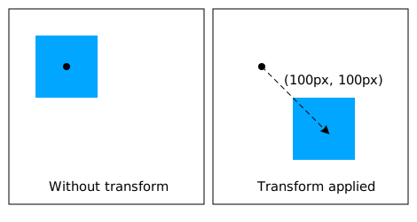

[UP](./index.md)

# transform property
the transform property has access to scale(), skewX() and skewY

## scale()
To change the scale of an element, CSS has the transform property, along with its scale() function. The following code example doubles the size of all the paragraph elements on the page:  

	div {transform:scale(2);}

1

2

0.5

### using scaling for interactivity
The transform property has a variety of functions that lets you scale, move, rotate, skew, etc., your elements. When used with pseudo-classes such as :hover that specify a certain state of an element, the transform property can easily add interactivity to your elements.

Here's an example to scale the paragraph elements to 2.1 times their original size when a user hovers over them:

	#grow:hover {transform: scale(2.1);}

#grow

## translate()
repositions an element in the horizontal and/or vertical directions  

## skewX() and skewY()
skews the selected element along its X (horizontal) axis by a given degree.

	div {transform: skewX(-32deg);}

skewX(-32deg)

## skewY()
skews the selected element along its Y (vertical) axis by a given degree.

	div {transform: skewY(-32deg);}

skewY(-32deg)

