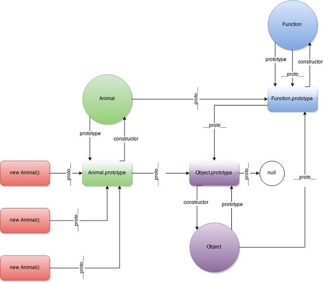

[UP](./index.md)

# Inheritance
Javascript uses a method called **Prototypal Inheritance**

## prototype property (\_\_proto\_\_)
Every JS object has an associated JavaScript object (or null, but this is rare) tied to it when it is created.  
This is called its prototype and can be accessed like this:  

	myObj.__proto__

## constructor property
Every JS object also has an associated JavaScript object tied to it when it is created.  
This is called its constructor and can be accessed like this:  

	myObj.constructor

The constructor is a reference to the function that created it.  
So for example:  

	const myObj = {} // this object has been created with the built in Object constructor

## prototype chain

	const myDate = new Date()

`myDate` was created using the `Date` constructor. So `myDate` has:
- `Date` as its constructor property
- Date.prototype as its \_\_proto\_\_  property

However, Date.prototype has its own prototype: Object.prototype.  
This creates a chain:  

**myDate &raquo; 	Date.prototype &raquo; 	Object.prototype &raquo; 	null**